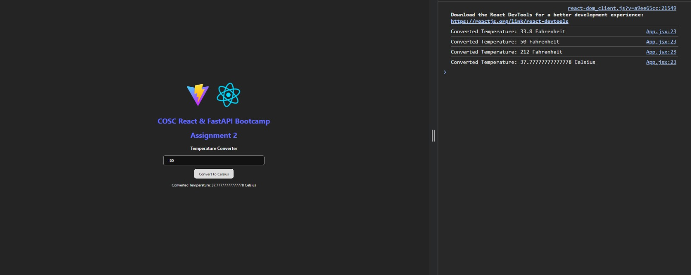

# Assignment 2: Celsius to Fahrenheit Converter

## Overview
In this assignment, you'll create a temperature converter using React and Vite. The application will allow users to convert temperatures between Celsius and Fahrenheit. Your task is to create an application using React and Vite.

## Objectives
Deepen your understanding of React, hooks, buttons, and input fields by building a simple temperature converter. Work with React components, manage state using hooks, and style the application using CSS.

## Tasks

### 1. Create a New React Application
Begin by creating a new React application using Vite. This will serve as the foundation for your temperature converter.

### 2. Import the Provided `convertTemperature.jsx` File
Copy the `convertTemperature.jsx` file provided and place it in the newly created folder. Import this file into your `App.jsx` component.

### 3. Add Input and Button Elements
Enhance your `App.jsx` component by adding the following elements:
- An input field to accept the temperature in Celsius or Fahrenheit.
- A button to trigger the conversion from Celsius to Fahrenheit and vice versa.
- Display the converted result dynamically.

### 4. Manage State with Hooks
Use `useState` and `useEffect` hooks to manage the input temperature and the converted temperature. Ensure that the result is also displayed in the browser's console.

### 5. Style the Application
Apply CSS styling to the input field and button within the `App.css` file. Make sure the styling aligns with a clean and user-friendly design.

### 6. Update the Content of the `<h1>` Tag
Modify and add the `<h1>` tag in `App.jsx` to display:
- COSC ReactJS and FastAPI Bootcamp
- Roll Number . (Followed by your roll number)
- Assignment 2: Celsius to Fahrenheit Converter

## Expected Output

